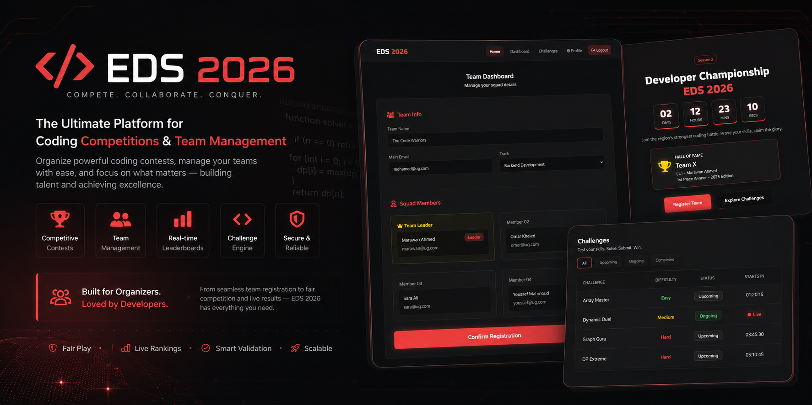

# EDS 2026 — Grand Championship Platform

## Overview

EDS 2026 is a full-stack competition management platform designed to streamline the registration, organization, and management of programming and cybersecurity competitions.

The platform provides participants, team leaders, and organizers with a modern, responsive, and secure environment for managing every stage of the competition lifecycle.

---

## Features

* Secure Authentication System
* Team Registration & Management
* User Dashboard
* Competition Countdown
* Hall of Fame
* Team & Participant Management
* Learning Timeline
* Progress Tracking
* Deliverables Management
* Responsive UI/UX
* Firebase Authentication
* Cloud Firestore Integration
* Real-Time Data Synchronization

---

## Technology Stack

### Frontend

* HTML5
* CSS3
* JavaScript

### Backend

* Firebase Authentication
* Cloud Firestore
* Firebase Hosting

---

## Project Status

✅ Full-Stack Application

The platform is fully designed and implemented with a complete frontend, backend integration, authentication system, database architecture, and production-ready workflows.

---

## My Role

**Founder • Full-Stack Developer • UI/UX Designer**

This project was independently designed and developed by **Mohamed Soliman**, including:

* Product Planning
* System Architecture
* UI/UX Design
* Frontend Development
* Backend Integration
* Firebase Database Design
* Authentication System
* Testing & Deployment

---

## Intellectual Property

**EDS 2026** is an original software project created and owned by **Mohamed Soliman**.

All source code, system architecture, user interface, workflows, branding, database structure, visual assets, and documentation are protected intellectual property.

This repository is published for **portfolio and demonstration purposes only**.

You may **not**:

* Copy or redistribute the source code.
* Reuse the UI/UX design.
* Reproduce the platform or its architecture.
* Create derivative works based on this project.
* Use any part of this project for commercial purposes without prior written permission.

© 2026 Mohamed Soliman. All Rights Reserved.

---

## Contact

GitHub: https://github.com/Mohammmedsoliman

LinkedIn: https://linkedin.com/in/mohamed-soliman-se
